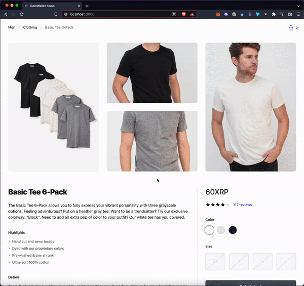

# 💎 GemWallet Extension

<!-- ALL-CONTRIBUTORS-BADGE:START - Do not remove or modify this section -->
[](#contributors-)
<!-- ALL-CONTRIBUTORS-BADGE:END -->

## GemWallet: A crypto wallet & Web3 layer for the XRPL


[](https://github.com/GemWallet/gemwallet-extension/blob/master/LICENSE)
[](https://chrome.google.com/webstore/detail/gemwallet/egebedonbdapoieedfcfkofloclfghab)
[](https://chrome.google.com/webstore/detail/gemwallet/egebedonbdapoieedfcfkofloclfghab)


[](https://chrome.google.com/webstore/detail/gemwallet/egebedonbdapoieedfcfkofloclfghab)
[](https://twitter.com/gemwallet_app)
[](https://discord.gg/CnkP9KGHBe)
[](https://www.youtube.com/channel/UCP980esJwyzU7qU4qZQ6A5Q)

## Useful links

- Download on the [Chrome Store](https://chrome.google.com/webstore/detail/gemwallet/egebedonbdapoieedfcfkofloclfghab)
- Visit the [official website](https://gemwallet.app)
- Visit the [documentation](https://gemwallet.app/docs/user-guide/introduction)
- Join us on [Discord](https://discord.gg/CnkP9KGHBe)
- Follow us on [Twitter](https://twitter.com/gemwallet_app)
- Watch our tutorials on [YouTube](https://www.youtube.com/channel/UCP980esJwyzU7qU4qZQ6A5Q)

## Introduction

GemWallet is a cutting-edge crypto wallet and Web3 layer for the XRP Ledger (XRPL). Our browser extension enables you to make fast and secure payments on the XRP Ledger directly from your browser. Say goodbye to the hassle of copying and pasting private keys, and join the revolution of effortless blockchain transactions with GemWallet. Experience the future of finance with us today.



## Join the Discord of the community

Wanna help? You can raise an issue or send a pull request.

We also have a [Discord channel](https://discord.gg/CnkP9KGHBe), feel free to join it

## Getting Started

First, run husky:

```bash
npm run prepare
```

Then, give the proper rights to the githooks:

```bash
chmod +x .husky/*
```

## Available Scripts

This repository is using `yarn workspaces` to handle the monorepo. Please to use the yarn when indicated bellow.

In the project directory, you can run:

### `yarn build`

Builds the extension GemWallet for production to the `packages/extension/build` folder.
It correctly bundles React in production mode and optimizes the build for the best performance.

### `yarn build:api:cdn`

Builds the GemWallet's API for a CDN delivery in the `dist` folder.

### `yarn build:api:npm`

Builds the GemWallet's API for an NPM delivery in the `package/api/dist` folder.

### `yarn lint`

Lint all the packages in the repo.

### `yarn prepare`

Prepare the repository to accept Husky, useful for development.

### `yarn prettier`

Prettify JavaScript (.js) and TypeScript (.ts, .tsx) files.

### `npm run release:api:npm`

Release the API package on the npm registry. Before doing the release make sure that the version of the API is the correct one in the file: `packages/api/package.json`.

### `yarn start`

Runs the extension in the development mode.
Open http://localhost:3000 to view it in the browser.

### `yarn start:api`

Runs the API in the development mode.
Open http://localhost:8080 to view it in the browser.

### `yarn test`

Run unit tests for all the packages of the repository.

## License

GemWallet is open source software licensed under the file [LICENSE](LICENSE) in that repository.

## Contributors ✨

Thanks goes to these wonderful people ([emoji key](https://allcontributors.org/docs/en/emoji-key)):

<!-- ALL-CONTRIBUTORS-LIST:START - Do not remove or modify this section -->
<!-- prettier-ignore-start -->
<!-- markdownlint-disable -->
<table>
  <tbody>
    <tr>
      <td align="center" valign="top" width="14.28%"><a href="https://www.linkedin.com/in/florianbouron/"><br /><sub><b>Florian</b></sub></a><br /><a href="https://github.com/GemWallet/gemwallet-extension/commits?author=FlorianBouron" title="Code">💻</a> <a href="https://github.com/GemWallet/gemwallet-extension/commits?author=FlorianBouron" title="Documentation">📖</a> <a href="#maintenance-FlorianBouron" title="Maintenance">🚧</a></td>
      <td align="center" valign="top" width="14.28%"><a href="https://github.com/wojake"><br /><sub><b>Wo Jake</b></sub></a><br /><a href="#security-wojake" title="Security">🛡️</a></td>
      <td align="center" valign="top" width="14.28%"><a href="http://www.wietse.com"><br /><sub><b>Wietse Wind</b></sub></a><br /><a href="#security-WietseWind" title="Security">🛡️</a> <a href="#example-WietseWind" title="Examples">💡</a></td>
      <td align="center" valign="top" width="14.28%"><a href="https://github.com/mmaryo"><br /><sub><b>Mario</b></sub></a><br /><a href="https://github.com/GemWallet/gemwallet-extension/commits?author=mmaryo" title="Code">💻</a></td>
      <td align="center" valign="top" width="14.28%"><a href="https://github.com/TusharPardhe"><br /><sub><b>Tushar Pardhe</b></sub></a><br /><a href="https://github.com/GemWallet/gemwallet-extension/commits?author=TusharPardhe" title="Code">💻</a></td>
      <td align="center" valign="top" width="14.28%"><a href="https://fr.linkedin.com/in/thibautbremand"><br /><sub><b>Thibaut Bremand</b></sub></a><br /><a href="https://github.com/GemWallet/gemwallet-extension/commits?author=ThibautBremand" title="Code">💻</a> <a href="#infra-ThibautBremand" title="Infrastructure (Hosting, Build-Tools, etc)">🚇</a> <a href="https://github.com/GemWallet/gemwallet-extension/commits?author=ThibautBremand" title="Documentation">📖</a></td>
      <td align="center" valign="top" width="14.28%"><a href="https://github.com/markibanez"><br /><sub><b>Mark Ibanez</b></sub></a><br /><a href="https://github.com/GemWallet/gemwallet-extension/issues?q=author%3Amarkibanez" title="Bug reports">🐛</a></td>
    </tr>
    <tr>
      <td align="center" valign="top" width="14.28%"><a href="https://github.com/florent-uzio"><br /><sub><b>Florent</b></sub></a><br /><a href="https://github.com/GemWallet/gemwallet-extension/issues?q=author%3Aflorent-uzio" title="Bug reports">🐛</a> <a href="#ideas-florent-uzio" title="Ideas, Planning, & Feedback">🤔</a> <a href="https://github.com/GemWallet/gemwallet-extension/commits?author=florent-uzio" title="Code">💻</a></td>
      <td align="center" valign="top" width="14.28%"><a href="https://github.com/benaor"><br /><sub><b>Benjamin</b></sub></a><br /><a href="https://github.com/GemWallet/gemwallet-extension/commits?author=benaor" title="Code">💻</a></td>
      <td align="center" valign="top" width="14.28%"><a href="https://github.com/rikublock"><br /><sub><b>Riku</b></sub></a><br /><a href="https://github.com/GemWallet/gemwallet-extension/issues?q=author%3Arikublock" title="Bug reports">🐛</a> <a href="#ideas-rikublock" title="Ideas, Planning, & Feedback">🤔</a> <a href="https://github.com/GemWallet/gemwallet-extension/commits?author=rikublock" title="Code">💻</a></td>
      <td align="center" valign="top" width="14.28%"><a href="https://github.com/tfevre"><br /><sub><b>tfevre</b></sub></a><br /><a href="https://github.com/GemWallet/gemwallet-extension/issues?q=author%3Atfevre" title="Bug reports">🐛</a></td>
      <td align="center" valign="top" width="14.28%"><a href="https://www.linkedin.com/in/afolabisunday/"><br /><sub><b>Afolabi Sunday</b></sub></a><br /><a href="#ideas-garantor" title="Ideas, Planning, & Feedback">🤔</a> <a href="https://github.com/GemWallet/gemwallet-extension/issues?q=author%3Agarantor" title="Bug reports">🐛</a></td>
      <td align="center" valign="top" width="14.28%"><a href="https://github.com/qlemaire"><br /><sub><b>Quentin Lemaire</b></sub></a><br /><a href="#security-qlemaire" title="Security">🛡️</a></td>
      <td align="center" valign="top" width="14.28%"><a href="https://github.com/mworks-proj"><br /><sub><b>meister</b></sub></a><br /><a href="https://github.com/GemWallet/gemwallet-extension/commits?author=mworks-proj" title="Code">💻</a> <a href="#ideas-mworks-proj" title="Ideas, Planning, & Feedback">🤔</a></td>
    </tr>
    <tr>
      <td align="center" valign="top" width="14.28%"><a href="https://github.com/Daviran"><br /><sub><b>David Bugnon</b></sub></a><br /><a href="#security-Daviran" title="Security">🛡️</a></td>
    </tr>
  </tbody>
</table>

<!-- markdownlint-restore -->
<!-- prettier-ignore-end -->

<!-- ALL-CONTRIBUTORS-LIST:END -->

This project follows the [all-contributors](https://github.com/all-contributors/all-contributors) specification. Contributions of any kind welcome!
