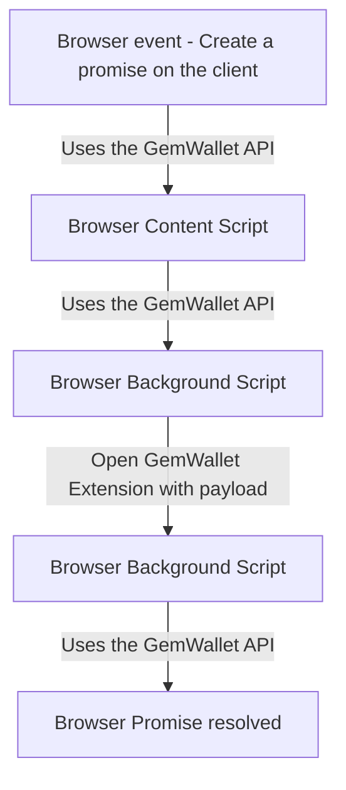

# GemWallet API

## Introduction

This packages builds a wrapper around the messaging system used to interact with
the GemWallet extension. Client applications will be able to install this package
from npm or via CDN.
It also contains constants that may need to be imported into other repositories in the GemWallet project.

For instructions on how to integrate with GemWallet API, visit: https://gemwallet.app/docs/user-guide/introduction

## Architecture

The API and the extension are communicating via [Message events](https://developer.mozilla.org/en-US/docs/Web/API/MessageEvent) via [cross-document messaging](https://developer.mozilla.org/en-US/docs/Web/API/Window/postMessage).

### Architecture diagram

